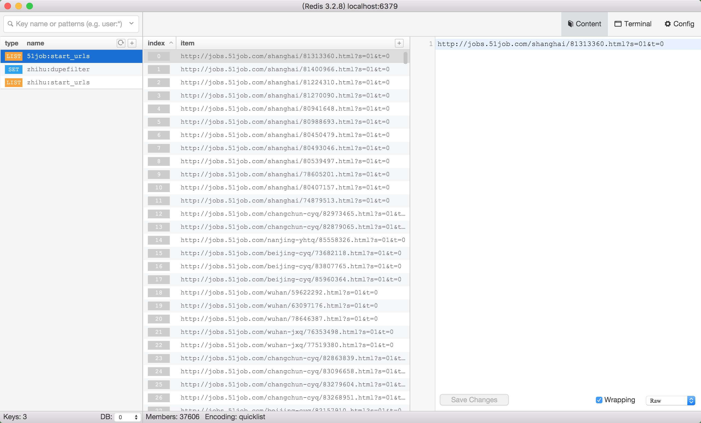
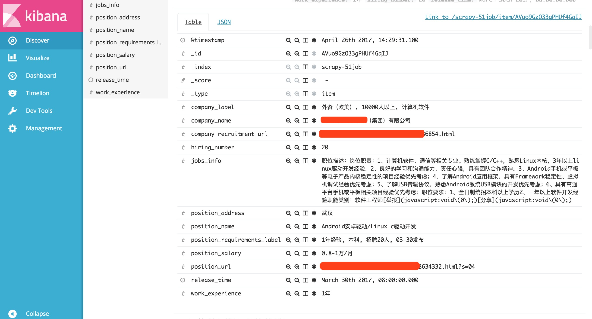
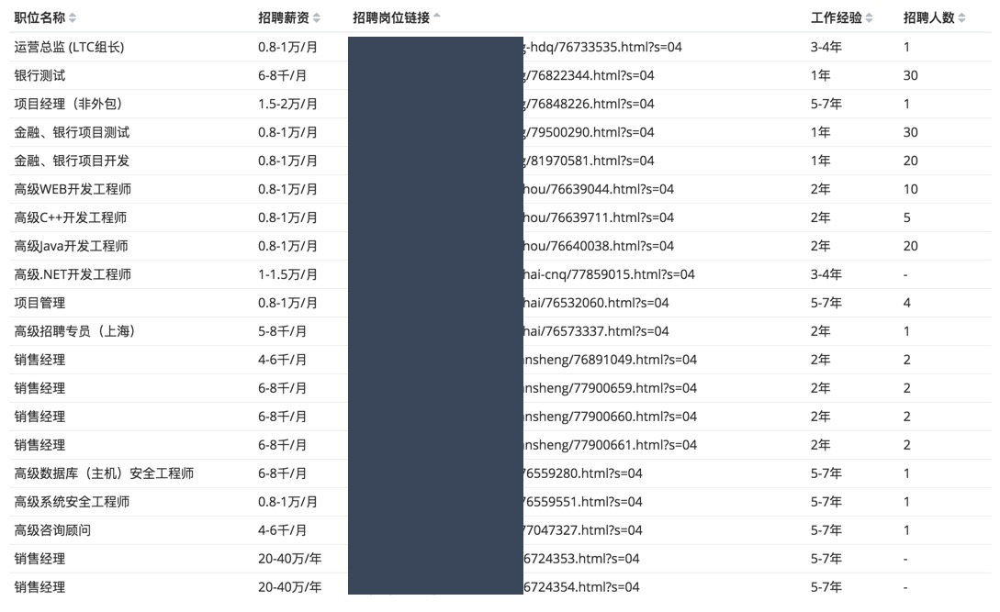

# Scarpy 爬取 51job 企业岗位信息

使用代码前请保证您的用途是合法的，此代码虽然开源但是不作用于任何非法渠道使用或者非法盈利场景，不存在侵权!

下载分支代码:
```
$ git clone -b elasticsearch https://github.com/slzcc/Scrapy-51job-jobs.git
```

需要准备的服务:
  * Redis
  * Elasticsearch

## 内置参数说明
爬虫已经使用 Docker 封装好，只需要调用所需的环境变量更改服务地址等信息。
Redis 服务地址
```
REDIS_DB_HOST=127.0.0.1
REDIS_DB_PORT=6379
```
Elasticsearch 服务地址以及 index 名称
```
ELASTICSEARCH_DB_SERVER=http://localhost:9200
ELASTICSEARCH_DATA_INDEX=scrapy-51job
ELASTICSEARCH_DATA_TYPE=item
```
Scrapy 并发数
```
CONCURRENT_REQUESTS = 32
```
Scrapy 每秒请求间隔时间单位 `秒`，默认为 1
```
DOWNLOAD_DELAY = 1
```

## 准备 URL 地址 (可选)
方法一、首先需要搜索公司名称或者职位名称获取 `URL` 爬虫所需地址，这里只需要执行内部方法即可
```
$ docker run --rm -it -e REDIS_DB_HOST=127.0.0.1 -e ELASTICSEARCH_DB_SERVER=http://localhost:9200 registry.aliyuncs.com/slzcc/scrapy-51job-jobs:elasticsearch-2.0 python company_resume_51job/company_name.py
```
>注意: 这里需要输入的是准确的公司全名，否则会有很多不相干的信息被爬取，如果是职位名称则没任何问题，只要在浏览器当中看到的所有信息都会被爬取下来。

效果:
```
$ docker run --net host --rm -it -e REDIS_DB_HOST=127.0.0.1 registry.aliyuncs.com/slzcc/scrapy-51job-jobs:elasticsearch-1.0 python company_resume_51job/company_name.py
Please according to the prompt to input, must strictly careful operation in order to avoid waste your how many repair operations.
Please enter 'http://www.51job.com/' website for company name to crawl, must be the full name, it doesn't matter too much or you will climb to the company requirements.
Please enter the need to search the company name: 运维
http://search.51job.com/list/000000,000000,0000,00,9,99,%E8%BF%90%E7%BB%B4,2,2.html
http://search.51job.com/list/000000,000000,0000,00,9,99,%E8%BF%90%E7%BB%B4,2,3.html
http://search.51job.com/list/000000,000000,0000,00,9,99,%E8%BF%90%E7%BB%B4,2,4.html
....
```
上图中输入需求即可，如果输入的是一个职业，会列出所有你能看到的公司岗位信息整个爬取一遍，此方法是获取搜索引擎获取招聘信息表进行爬取，此类方法适合范围查询，不适合精确查询。

方法二、获取公司公司的招聘主页如地址 `http://jobs.51job.com/all/co2204116.html`:
执行内部方法输入获取的 URL :
```
$ docker run --rm -it -e REDIS_DB_HOST=127.0.0.1 registry.aliyuncs.com/slzcc/scrapy-51job-jobs:elasticsearch-2.0 python company_resume_51job/company_url.py
```
此方法是把公司招聘主页的对应公布的招聘信息表进行爬取。

>需要重点注意：Redis Server 对应的必须为 `IP` 如果需要使用 `HOST` 请配合 Docker `--add-host` 使用。

## 运行服务
服务的运行和准备 `URL` 地址并没有直接的关系，如果 Redis 队列中没有 `URL` 地址，则会一直等待。
```
$ docker run --net host -d -e DOWNLOAD_DELAY=0 -e REDIS_DB_HOST=127.0.0.1 -e ELASTICSEARCH_DB_SERVER=http://localhost:9200 -e CONCURRENT_REQUESTS=100 registry.aliyuncs.com/slzcc/scrapy-51job-jobs:elasticsearch-2.0
```
## 效果图
Redis 效果展示

Elasticsearch 效果展示

使用饼图划分，内圈为公司名称，中间圈为岗位名称，外圈为薪资。

按照饼图的划分后，使用表图进行更细致化的数据划分，如图

包括 url，发布日期，工作经验，学历等等。
